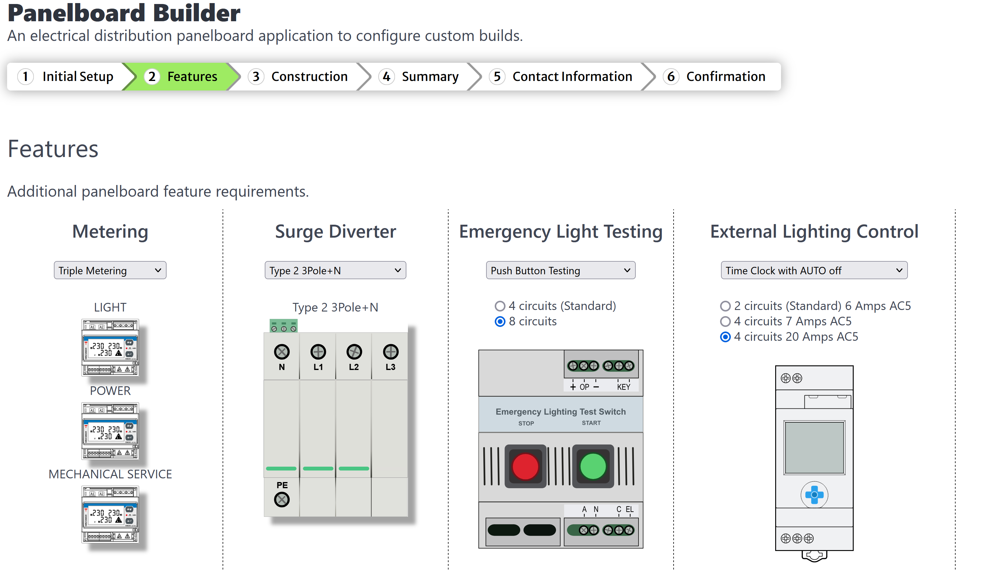

# Panelboard-Builder Application
Visual experience app for users when assembling the components required in building an electrical distribution panelboard.

First prototype layout.

_(You can not complete building a full panelboard at this stage)_

*TO BE DONE*

## Dependencies
- Uses BULMA CSS Framework 1.0.2

## Screen shots

